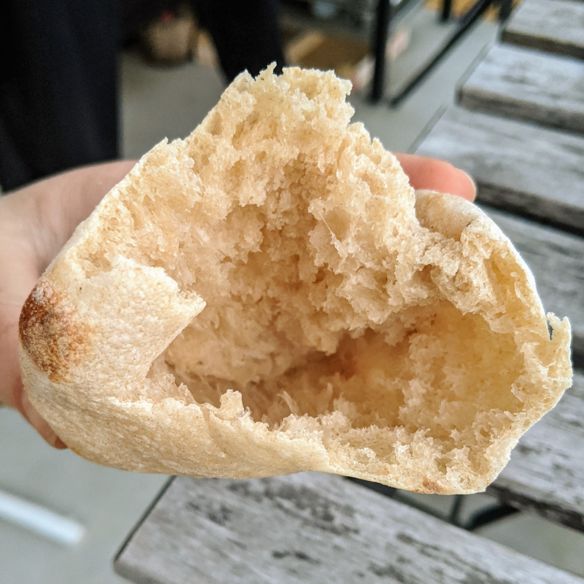

# Sourdough Pitta

Contributed by [sholgz](https://github.com/sholgz)

There is nothing like a warm and fluffy pitta to go along with a freshly prepared humus or shakshuka.
Pittas keep extremely well in the freezer, so make a dozen, put them in the freezer bag and just pop it in the toaster before use. I prefer my pittas made out of sourdough because I really like the depth of the flavour which comes with it and IMO it  keeps better in the freezer.
If you can't be bothered with sourdough, longer cold fermentation should also do the trick. I would suggest proofing for ~24-36h in the fridge.

## General approach
I usually use the same proportion here as with standard bread making, mainly because I don't know any better.
* 75% hydration
* 20% active sourdough (or 1% commercial yeast)
* 2% salt

Sometimes I substitute water for whey, just because I have easy access to it. This makes the dough slightly richer and gives it a nice sweet sour flavour.
For the technique, theoretically you can follow one of the many sourdough bread recipes available on youtube, and make half of the recipe into bread and with the other half make the pitta. This is a bit too much fuss for me when I only want to make the pitta, so in my recipe I describe a shorter version for lazy people. :)

### Ingredients for ~10 pittas
* 500g Half-white flour
* 375g water
* 100g active sourdough starter / 5g commercial yeast
* 10g salt

### Technique

Mix together water, starter and the flour, get it to the state of sticky mess and let the dough meditate for 40 min.
Once the dough is rested and some gluten is developed, add the salt and start kneading the dough.
You can knead the dough by hand using slap and fold technique or alternatively use a mixer with a dough hook. At the end of the process the dough should pass the windowpane test, it will take ~10 min. Move the dough to a clean bowl, cover it and let it slowly ferment in the fridge for 12h or longer (when using commercial yeast, I would suggest extending the fermentation period to 24 - 36h).
If you followed the bread making technique, skip the shaping stage and just put the dough you want to make pittas from in the fridge.

### Shaping and baking
2-3 hours before you want to bake the pitta, take the dough out of the fridge.
Divide it into 100g pieces, and shape them into balls. Let the pittas prove at the room temperature for about 2h.
I usually bake my pittas on a pizza stone or a cast iron skillet pan.

Preheat the oven together with a pizza stone or a pan to 250° C.

Once pittas have roughly doubled in size, dust them with flour on both sides and flatten them by hand to 5mm thick disks.
Now you are ready to bake!
Take a disk and put it on the hot pizza stone/skillet and close the oven, it will take ~5 min per pitta. I usually bake one pitta at a time, just because my pizza stone is pretty small.
It's a very exciting process to watch your pittas rising and becoming a balloon. Pittas are ready when they all puffed up.
Take them out and wrap in a clean tea towel to keep them soft.

Eat them fresh with some humus, or freeze for later.

Enjoy!

